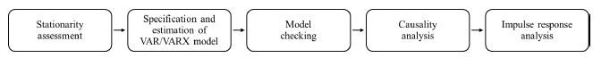
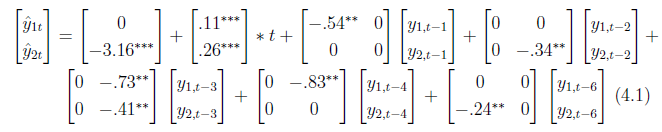
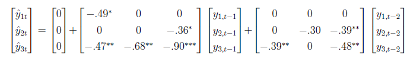

# The Dynamics of Wealth & Income Inequality: Assessment of Temporal Relationships and Influence of GDP & Interest Rates
GitHub Repo for semester project at HU Berlin using a VAR model to explain wealth and income inequality developments in the U.S.

## Background
* **Economic inequality is high in the United States**, both when assessing income and wealth inequality. The **top 10% receives 45.5% of the total income** (Chancel et al., 2022). In contrast, the bottom 50% earns just 13.3%. The economic divide is even more apparent when examining wealth inequality, where the **top 10% owns
above 70% of the nation’s wealth**, whereas the bottom half owns 1.5% of the total wealth.
* While much work has been done on the descriptive measurement of inequality and also its consequences, **little research has modeled indicators of economic inequality using time series analyses**. Only recently, research has began to study the **effects of macroeconomic variables** on the trajectories of wealth and income inequality (e.g., Berisha & Meszaros, 2020). 

## Objective
* Assess the reciprocal **dynamics of wealth and income inequality in the U.S.** based on a new dataset by Kuhn et al. (2020) on U.S. households in the postwar period.
* Study the **effects of interest rates and GDP** on both inequality indicators to partially explain the trajectories.

## Approach
* Use a **Vector Autoregressive Model (VAR)** to model the reciprocal relationships between the inequality measures and a **VARX** model that allows the use of exogenous variables. 
* Follow a **five-step process** to derive results, which focuses on explaining relationships between variables and testing hypotheses (not prediction performance):

## Key Results
* A **VAR(6)**-model showed the best model fit according to AIC and SC criteria. The resulting models are presented below:

* Also, a **VARX(3,3)-model** was used including interest rates (endogenous) and GDP (exogenous) based on a Granger causality test:

* Surprisingly, wealth inequality **did not granger cause** income inequality nor vice versa. **GDP reduced the residual error covariance matrix** compared to a pure VAR model and **interest rates showed a reciprocal relationship with income inequality** and an effect on wealth inequality in some lags.

## Installation Instructions
* Install **R (4.2.1) and RStudio**
* Download the macroeconomic dataset from the GitHub Repo and the SCF+ data from Kuhn et al. (2017) from the Google Drive: https://drive.google.com/drive/folders/1fDQmMi-66BoRTC8Ob9RjARZuvg1Yr2md?usp=sharing
* Change the **data loading path** to your local working directory
* Run the script and read the accompagnying written report
